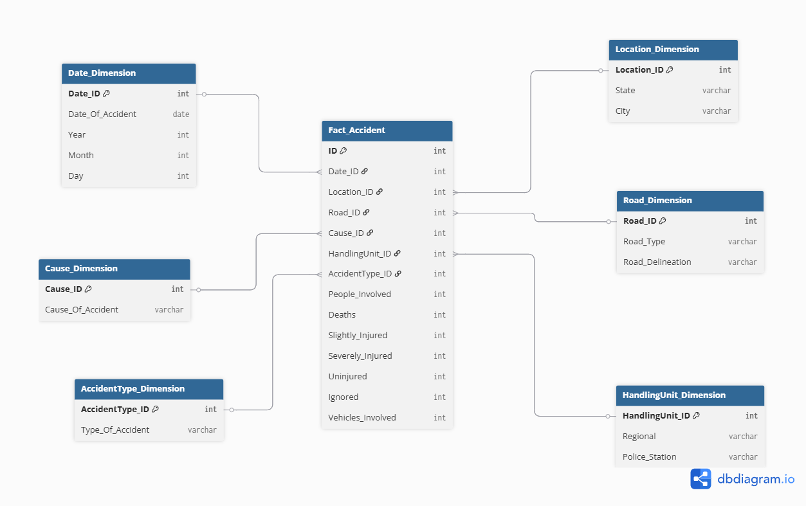
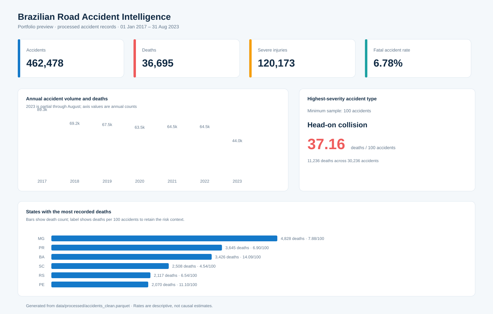
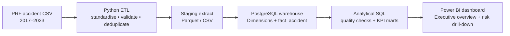

# Brazilian Road Accident Intelligence

> An end-to-end analytics engineering project that turns Brazilian federal-road accident records into a queryable star-schema warehouse for safety, severity, and geographic-risk analysis.





## Why this project matters

Road-safety decisions need more than a spreadsheet of incidents. This project models individual accident records at a consistent grain, makes severity measures comparable across time and locations, and enables analysts to identify **where**, **when**, and **why** serious accidents happen.

It was built to demonstrate the workflow expected of a data/BI analyst: source profiling, repeatable Python transformations, dimensional modelling, data-quality controls, warehouse DDL, and stakeholder-facing analytical queries.

## What a recruiter can evaluate quickly

| Area | Evidence in this repository |
| --- | --- |
| Data transformation | [`src/etl.py`](src/etl.py) standardises source fields, validates records, creates reusable dimension extracts, and writes a fact-ready dataset. |
| Dimensional modelling | [`sql/01_create_warehouse.sql`](sql/01_create_warehouse.sql) implements a star schema at one row per accident. |
| Analytical SQL | [`sql/03_analytics_queries.sql`](sql/03_analytics_queries.sql) answers risk, geography, seasonality, and severity questions. |
| Data quality | [`src/quality.py`](src/quality.py) reports null, duplicate, invalid-date, and reconciliation checks. |
| BI delivery | [`docs/dashboard-spec.md`](docs/dashboard-spec.md) defines the dashboard pages, KPI logic, and interaction design. |

## Business questions answered

1. Which states, cities, and police jurisdictions account for the highest number of fatal and severe accidents?
2. Which accident causes and accident types carry the highest fatality rate—not merely the highest volume?
3. How does risk change by year, month, and day of week?
4. Which combinations of road type and road delineation need targeted safety intervention?
5. Where should a safety team investigate first, using both volume and severity?

## Evidence from the dataset

The current reproducible extract contains **462,478 accidents**, **36,695 deaths**, and **120,173 severe injuries** (01 Jan 2017–31 Aug 2023). These are descriptive results, not causal claims.

- **Minas Gerais** recorded the most deaths (4,828), while **Bahia** had the highest death intensity among the seven highest-volume states (14.09 deaths per 100 accidents).
- **Head-on collisions** were the most severe high-volume accident type: 11,236 deaths, or 37.16 deaths per 100 accidents.
- *Driver's lack of attention to conveyance* produced the most deaths by volume (5,730), whereas the causes with the highest rates require a minimum-volume threshold before prioritisation.

The preview is generated directly from the processed dataset by [`src/build_dashboard_preview.py`](src/build_dashboard_preview.py), so it can be refreshed after an ETL run.
For the full scope, quality summary, and interpretation notes, see the [data profile](docs/data-profile.md).

## Architecture



## Data model

**Grain:** one row in `fact_accident` represents one recorded road-traffic accident. Numeric columns are additive measures at that grain: people involved, deaths, injury counts, and vehicles involved.

The fact joins six conformed dimensions: date, location, road, cause, accident type, and handling unit. See the [data dictionary](docs/data-dictionary.md) and [dbdiagram source](docs/star-schema.dbml).

## Key metrics

| Metric | Definition |
| --- | --- |
| Accidents | `COUNT(*)` at the accident grain |
| Fatal accidents | Accidents where `deaths > 0` |
| Fatality rate | Fatal accidents / total accidents |
| Deaths per 100 accidents | `100 * SUM(deaths) / COUNT(*)` |
| Severe injury rate | `SUM(severely_injured) / SUM(people_involved)` |

Rates are displayed alongside counts to avoid mistaking high exposure for high risk.

## Repository structure

```text
├── src/                 # Repeatable ETL and data-quality checks
├── sql/                 # DDL, load pattern, analytical queries
├── docs/                # Dashboard specification, data dictionary, diagrams
├── data/
│   ├── raw/             # Downloaded source CSV (not versioned)
│   └── processed/       # Generated ETL output (not versioned)
├── requirements.txt
└── README.md
```

## Run locally

1. Create a virtual environment and install dependencies:

   ```bash
   pip install -r requirements.txt
   ```

2. Place the source file at `data/raw/accidents_2017_to_2023_english.csv`.

3. Build a clean, fact-ready extract and quality report:

   ```bash
   python -m src.etl
   ```

4. Create the PostgreSQL warehouse with [`sql/01_create_warehouse.sql`](sql/01_create_warehouse.sql), load the processed CSV, then run [`sql/03_analytics_queries.sql`](sql/03_analytics_queries.sql).

Detailed warehouse-loading assumptions are documented in [`sql/02_load_warehouse.sql`](sql/02_load_warehouse.sql).

## Dashboard design

The intended dashboard has an executive overview, geography & hotspot page, and contributing-factors page. It uses year, state, city, road type, and accident type as global filters. Full specification: [dashboard-spec.md](docs/dashboard-spec.md).

## Source and scope

- **Scope:** Brazilian federal road accident records, 2017–2023.
- **Source fields used:** accident date, state/city, road attributes, cause, accident type, handling unit, people, injuries, deaths, and vehicles.
- **Privacy:** no personal-level information is retained in the warehouse model.

## Design choices and limitations

- The model is designed for descriptive and diagnostic analytics; it does not claim causal inference or predictive accuracy.
- A separate `unknown` member is used for missing descriptive attributes, preserving fact records instead of silently dropping them.
- The source may evolve; mappings and validation rules are centralised in `src/etl.py` so they can be reviewed and versioned.

## Original academic artefacts

The original report and slides are retained for provenance, but this repository is organised around reproducible code and analytical delivery. Their contents are not required to run the project.
